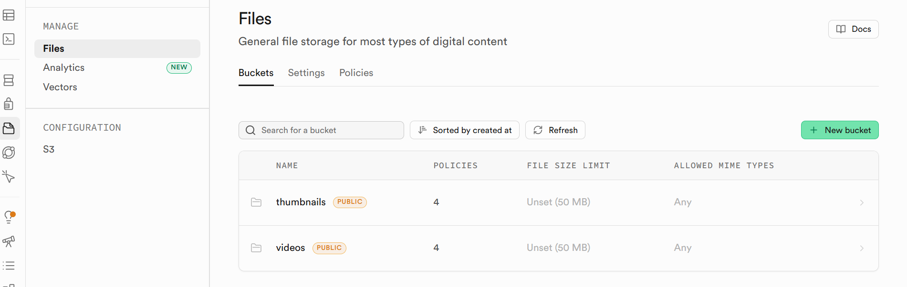
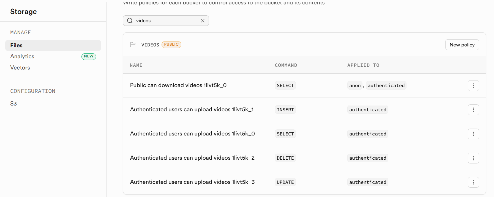
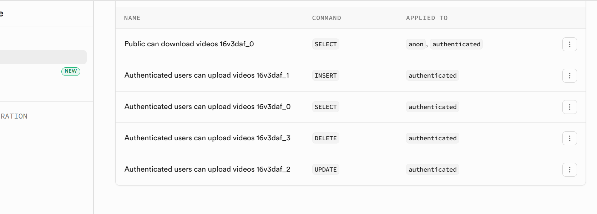
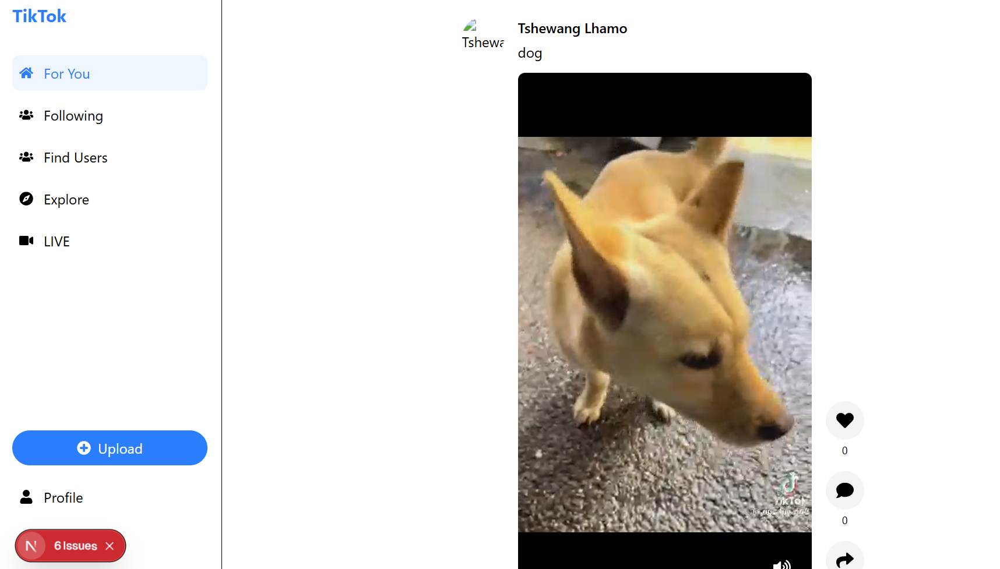
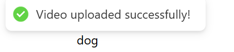

# Practical 5: Cloud Bucket Storage with Supabase

## Overview

This practical implements cloud-based file storage for the TikTok application using **Supabase Storage**, replacing local file uploads with direct browser-to-cloud uploads. This reduces server load and enables scalable video hosting.

## Objectives Achieved

✅ Migrate from local file storage to cloud storage (Supabase)  
✅ Implement direct browser-to-Supabase uploads  
✅ Store only metadata on backend database  
✅ Configure Supabase buckets with appropriate access policies  
✅ Integrate storage paths with Prisma database schema  
✅ Maintain backward compatibility with file upload fallback  

## Architecture

### Upload Flow

```
User Uploads Video
    ↓
Browser → Supabase Storage (Direct Upload)
    ↓
Get Public URLs for Video & Thumbnail
    ↓
Send URLs to Backend API
    ↓
Backend Creates Database Record (stores URLs & storage paths)
    ↓
Redirect to Home Page
```

### Key Components

**Frontend (Next.js 15.2.1)**
- `TikTok_Frontend-main/src/app/upload/page.jsx` - Upload UI with direct Supabase integration
- `TikTok_Frontend-main/src/services/uploadService.js` - Upload functions for video & thumbnail
- `TikTok_Frontend-main/src/lib/supabase.js` - Supabase client initialization

**Backend (Express.js)**
- `TikTok_Server-main/src/controllers/videoController.js` - Enhanced to accept URLs from browser
- `TikTok_Server-main/src/services/storageService.js` - Supabase storage operations
- `TikTok_Server-main/src/lib/supabase.js` - Backend Supabase client

**Database (Prisma)**
- `TikTok_Server-main/prisma/schema.prisma` - Video model with storage paths

## Implementation Steps

### 1. Supabase Setup

**Created Supabase Project**
- Project URL: `https://gfzphiwvnjbeefodgodk.supabase.co`
- Created two public storage buckets:
  - `videos` - For video files (PUBLIC access)
  - `thumbnails` - For thumbnail images (PUBLIC access)

**Configured Row-Level Security (RLS)**
- Initially faced RLS policy issues blocking uploads
- Solution: Created permissive INSERT policy for anonymous uploads:
```sql
CREATE POLICY "Allow anonymous uploads"
ON storage.objects
FOR INSERT
TO anon, public, authenticated
WITH CHECK (true);
```

### 2. Environment Configuration

**Backend (.env)**
```
SUPABASE_URL=https://gfzphiwvnjbeefodgodk.supabase.co
SUPABASE_SERVICE_KEY=eyJhbGciOiJIUzI1NiIsInR5cCI6IkpXVCJ9...
SUPABASE_PUBLIC_KEY=eyJhbGciOiJIUzI1NiIsInR5cCI6IkpXVCJ9...
SUPABASE_STORAGE_URL=https://gfzphiwvnjbeefodgodk.supabase.co/storage/v1
```

**Frontend (.env.local)**
```
NEXT_PUBLIC_SUPABASE_URL=https://gfzphiwvnjbeefodgodk.supabase.co
NEXT_PUBLIC_SUPABASE_PUBLIC_KEY=eyJhbGciOiJIUzI1NiIsInR5cCI6IkpXVCJ9...
NEXT_PUBLIC_API_URL=http://localhost:8000/api
```

### 3. Database Schema Update

Added storage path fields to Video model:
```prisma
model Video {
  id                    Int     @id @default(autoincrement())
  videoUrl              String
  thumbnailUrl          String?
  videoStoragePath      String  // Path in Supabase bucket
  thumbnailStoragePath  String? // Path in Supabase bucket
  // ... other fields
}
```

### 4. Frontend Upload Service

**uploadService.js** - Direct browser uploads to Supabase:
- `uploadVideoToStorage()` - Uploads video file to 'videos' bucket
- `uploadThumbnailToStorage()` - Uploads thumbnail to 'thumbnails' bucket
- `createVideo()` - Sends URLs to backend API

Features:
- Automatic thumbnail generation (optional)
- Progress tracking (0% → 50% → 75% → 100%)
- Detailed error logging

### 5. Upload Page Implementation

**page.jsx** - Handles upload flow:
1. Select video file and optional thumbnail
2. Upload video and thumbnail directly to Supabase
3. Get public URLs from Supabase
4. Send URLs + metadata to backend
5. Backend creates database record
6. Redirect to home page

Improvements made:
- Fixed React setState during render warnings
- Added useEffect for side effects (router.push)
- Improved error handling with nested try-catch blocks
- Progress indicators for each upload stage

### 6. Backend Update

**videoController.js** - createVideo() function now:
- Accepts direct URLs from frontend (new behavior)
- Maintains backward compatibility with file uploads (legacy)
- Stores video/thumbnail URLs in database
- Stores storage paths for future cleanup

```javascript
// Accepts either direct URLs from browser OR file uploads from server
if (!req.files?.video && !videoUrl) {
  return res.status(400).json({ message: 'Video file is required' });
}
```

### 7. Storage Service

**storageService.js** - Manages all Supabase operations:
- `uploadFile()` - Upload files with error handling
- `getPublicUrl()` - Get public access URLs
- `removeFile()` - Delete files from buckets
- `generateUniqueFileName()` - Create unique file names

## Challenges & Solutions

### Challenge 1: DNS Resolution Failed
**Issue:** `gmzphiwvnjbeefodgork.supabase.co` could not be resolved  
**Solution:** Used correct project URL `gfzphiwvnjbeefodgodk.supabase.co` from Supabase dashboard

### Challenge 2: RLS Policy Blocking Uploads
**Issue:** 403 "new row violates row-level security policy"  
**Root Cause:** RLS policies too restrictive for anonymous uploads  
**Solution:** Created permissive INSERT policy allowing anonymous uploads

### Challenge 3: Backend Expecting File Uploads
**Issue:** Backend multer middleware expecting file objects, but browser sent URLs  
**Solution:** Modified `createVideo()` to accept URLs directly from frontend

### Challenge 4: React setState During Render
**Issue:** "Cannot update Router while rendering UploadPage"  
**Solution:** Moved `router.push()` into useEffect hook

## Testing

**Manual Testing Steps:**
1. Start backend: `npm run dev` (port 8000)
2. Start frontend: `npm run dev` (port 3000)
3. Navigate to `http://localhost:3000/upload`
4. Select a video file
5. Click upload
6. Observe:
   - Video uploads directly to Supabase
   - Progress bar fills to 100%
   - Success message appears
   - Redirects to home page
7. Video record stored in database with Supabase URLs

**Verification:**
- Check Supabase Storage → videos bucket for uploaded file
- Check database Videos table for new record with videoUrl and storage paths
- Play video from home page to confirm playback works

## Screenshots & Verification

### 1. Supabase Storage Buckets Created

Shows both `videos` and `thumbnails` buckets created with PUBLIC access enabled.

### 2. Row-Level Security Policies Configured

Policies configured for the videos bucket allowing INSERT, SELECT, DELETE, UPDATE operations for authenticated users.

### 3. Upload Success Message

Confirmation that the video was uploaded successfully with caption "dog".

### 4. Video Playing in Feed

Successfully uploaded video is now displaying in the TikTok feed with metadata (user "Tshewang Lhamo", caption "dog", like and comment buttons).

### 5. Additional Verification

Shows the video policies and configuration details for thumbnails bucket.

## Project Structure

```
PRACTICAL5/
├── TikTok_Frontend-main/
│   ├── src/
│   │   ├── app/
│   │   │   └── upload/
│   │   │       └── page.jsx              [UPDATED] Direct Supabase upload
│   │   ├── services/
│   │   │   └── uploadService.js          [UPDATED] Browser upload functions
│   │   └── lib/
│   │       └── supabase.js               [CREATED] Supabase client
│   └── .env.local                        [CREATED] Supabase credentials
│
├── TikTok_Server-main/
│   ├── src/
│   │   ├── controllers/
│   │   │   └── videoController.js        [UPDATED] Accept URLs from browser
│   │   ├── services/
│   │   │   └── storageService.js         [UPDATED] Supabase operations
│   │   └── lib/
│   │       └── supabase.js               [CREATED] Backend Supabase client
│   ├── prisma/
│   │   └── schema.prisma                 [UPDATED] Added storage paths to Video
│   └── .env                              [UPDATED] Supabase credentials
│
└── README.md                             [THIS FILE]
```

## Key Technologies

- **Cloud Storage:** Supabase Storage (PostgreSQL-backed)
- **Frontend:** Next.js 15.2.1, React 19.0.0, Tailwind CSS
- **Backend:** Express.js, Node.js, Prisma ORM
- **Database:** PostgreSQL with Video model
- **Authentication:** JWT-based, Supabase auth

## Files Modified/Created

| File | Status | Changes |
|------|--------|---------|
| `TikTok_Frontend-main/src/app/upload/page.jsx` | Updated | Direct Supabase uploads, fixed React hooks |
| `TikTok_Frontend-main/src/services/uploadService.js` | Updated | Browser upload functions |
| `TikTok_Frontend-main/src/lib/supabase.js` | Created | Supabase client for browser |
| `TikTok_Frontend-main/.env.local` | Created | Public key + project URL |
| `TikTok_Server-main/src/controllers/videoController.js` | Updated | Accept URLs, maintain file upload fallback |
| `TikTok_Server-main/src/services/storageService.js` | Updated | Supabase storage operations |
| `TikTok_Server-main/src/lib/supabase.js` | Created | Supabase client for server |
| `TikTok_Server-main/prisma/schema.prisma` | Updated | Added storage path fields |
| `TikTok_Server-main/.env` | Updated | Supabase credentials |

## How It Works: Step by Step

1. **User Selects Video** → File validation on browser
2. **Generate Thumbnail** → Auto-generated from video (optional)
3. **Upload Video to Supabase** → Direct POST to `gfzphiwvnjbeefodgodk.supabase.co/storage/v1`
4. **Get Video URL** → Supabase returns public URL
5. **Upload Thumbnail to Supabase** → If provided
6. **Get Thumbnail URL** → Supabase returns public URL
7. **Send to Backend API** → POST `/api/videos` with URLs
8. **Backend Creates Record** → Saves to database with Supabase URLs
9. **Database Stores Metadata** → Video model with URLs + paths
10. **Redirect to Home** → User sees video in feed immediately

## Benefits of This Approach

✅ **Reduced Server Load** - No video processing on backend  
✅ **Faster Uploads** - Direct to cloud storage  
✅ **Scalable** - Supabase handles storage scaling  
✅ **Cheaper** - Only store URLs in database, not files  
✅ **Reliable** - Cloud storage is highly available  
✅ **Public CDN** - Supabase provides automatic CDN access  
✅ **Easy Deletion** - Remove files using stored paths  

## Future Improvements

- [ ] Implement optimistic UI updates
- [ ] Add upload resumption for large files
- [ ] Create cleanup script for orphaned uploads
- [ ] Add video transcoding for different quality levels
- [ ] Implement signed URLs for private videos
- [ ] Add virus scanning integration

## Troubleshooting

**Issue: "new row violates row-level security policy"**
- Check Supabase Storage → Policies tab
- Ensure INSERT policy exists with `WITH CHECK (true)`
- Verify policy applies to both `videos` and `thumbnails` buckets

**Issue: "Domain cannot be resolved"**
- Verify Supabase project URL from dashboard
- Check for typos in credentials
- Test connectivity: `nslookup gfzphiwvnjbeefodgodk.supabase.co`

**Issue: Backend returns 400 "Video file is required"**
- Ensure frontend sends `videoUrl` in request body
- Check uploadService.js sends correct data format
- Verify backend has been restarted after code changes

## Conclusion

This practical successfully implements cloud-based video storage using Supabase, enabling scalable and efficient video hosting for the TikTok application. The architecture separates concerns effectively, with the browser handling uploads directly to the cloud while the backend manages only metadata storage and business logic.

---

**Completed:** May 21, 2026  
**Practical:** Cloud Bucket Storage with Supabase  
**Student ID:** 02250377  
**Course:** WEB102